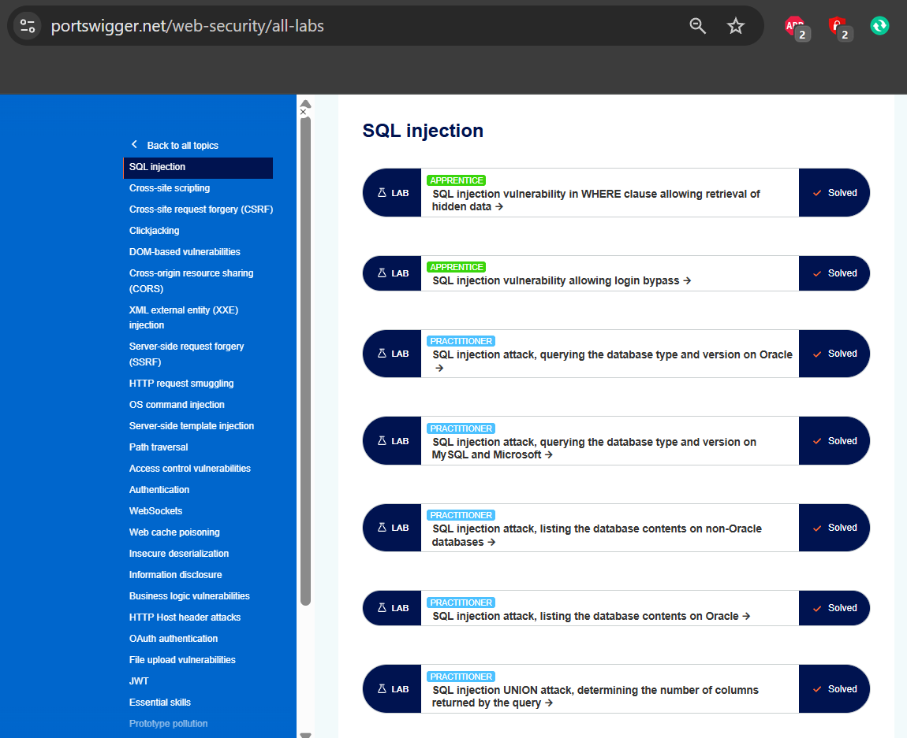
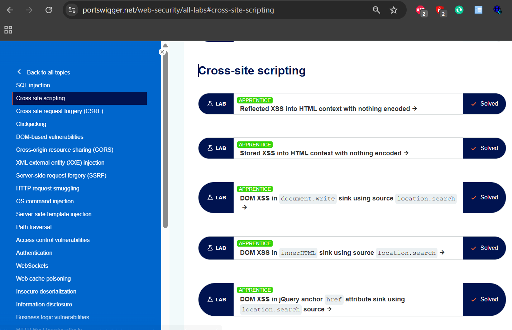
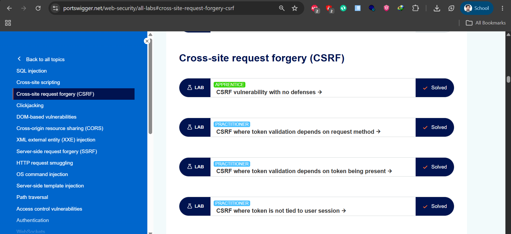
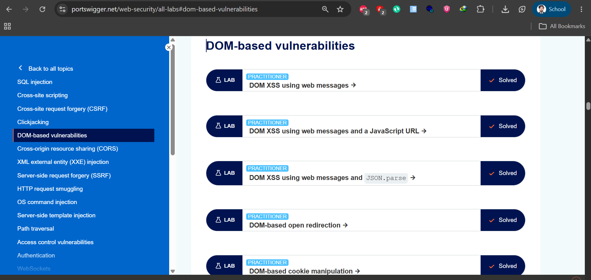
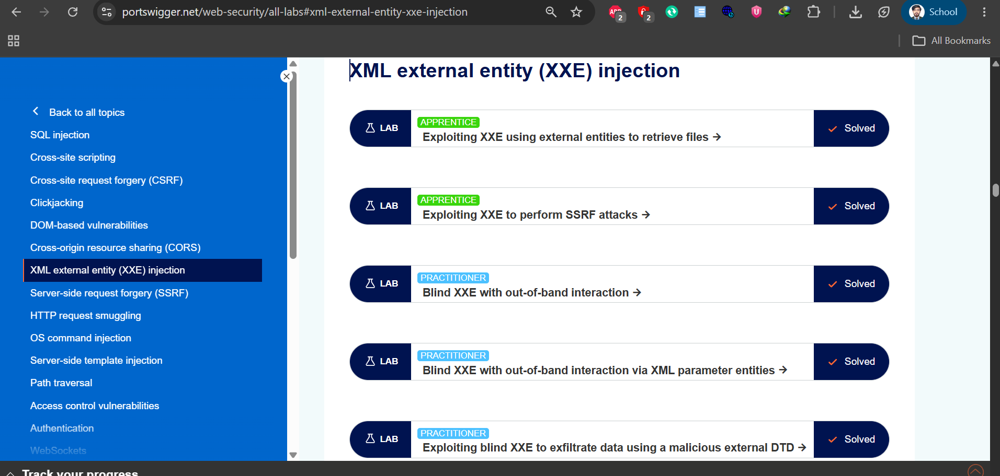
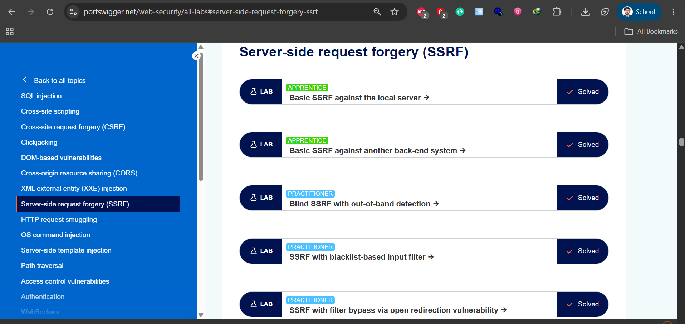
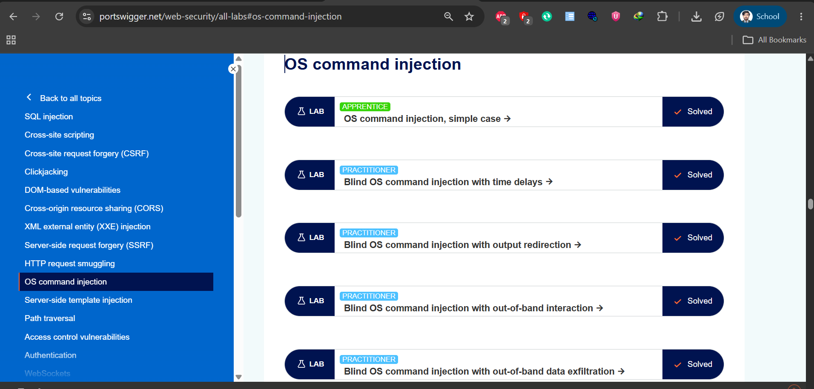
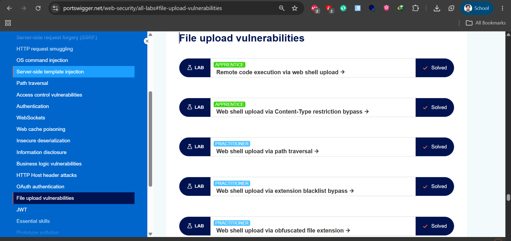

# 🔴 Web Application Penetration Testing
## PortSwigger Web Security Academy Labs


> Hands-on web application penetration testing through
> PortSwigger Web Security Academy labs. Covered 8 major
> vulnerability categories with 41+ labs solved across
> Apprentice and Practitioner difficulty levels.

---

## 📋 Project Overview

| Detail | Info |
|---|---|
| **Duration** | April 22 – May 2, 2025 |
| **Platform** | PortSwigger Web Security Academy |
| **Total Labs Solved** | 41+ |
| **Difficulty Levels** | Apprentice + Practitioner |
| **Primary Tool** | Burp Suite |
| **Framework** | OWASP Top 10 |

---

## 📁 Repository Structure

```
Web-Security-Labs/
└── screenshots/
    ├── sql-injection-labs.png
    ├── xss-labs.png
    ├── csrf-labs.png
    ├── dom-vulnerabilities-labs.png
    ├── xxe-injection-labs.png
    ├── ssrf-labs.png
    ├── os-command-injection-labs.png
    └── file-upload-labs.png
```

---

## 📊 Labs Summary

| # | Vulnerability Category | Labs Solved | Difficulty |
|---|---|---|---|
| 1 | SQL Injection | 7 | Apprentice + Practitioner |
| 2 | Cross-Site Scripting (XSS) | 5 | Apprentice |
| 3 | Cross-Site Request Forgery (CSRF) | 4 | Apprentice + Practitioner |
| 4 | DOM-Based Vulnerabilities | 5 | Practitioner |
| 5 | XML External Entity (XXE) | 5 | Apprentice + Practitioner |
| 6 | Server-Side Request Forgery (SSRF) | 5 | Apprentice + Practitioner |
| 7 | OS Command Injection | 5 | Apprentice + Practitioner |
| 8 | File Upload Vulnerabilities | 5 | Apprentice + Practitioner |
| **Total** | **8 Categories** | **41+ Labs** | |

---

## 🔵 1. SQL Injection



### Labs Completed

| Lab | Level | Status |
|---|---|---|
| SQL injection vulnerability in WHERE clause | Apprentice | ✅ Solved |
| SQL injection vulnerability allowing login bypass | Apprentice | ✅ Solved |
| SQL injection attack, querying DB type on Oracle | Practitioner | ✅ Solved |
| SQL injection attack, querying DB type on MySQL/Microsoft | Practitioner | ✅ Solved |
| SQL injection attack, listing DB contents on non-Oracle | Practitioner | ✅ Solved |
| SQL injection attack, listing DB contents on Oracle | Practitioner | ✅ Solved |
| SQL injection UNION attack, determining columns | Practitioner | ✅ Solved |

### Key Techniques Practiced
- Manual injection using ' OR 1=1--
- UNION-based data extraction
- Database fingerprinting (Oracle, MySQL, Microsoft)
- Login bypass via authentication manipulation

---

## 🟠 2. Cross-Site Scripting (XSS)



### Labs Completed

| Lab | Level | Status |
|---|---|---|
| Reflected XSS into HTML context with nothing encoded | Apprentice | ✅ Solved |
| Stored XSS into HTML context with nothing encoded | Apprentice | ✅ Solved |
| DOM XSS in document.write sink via location.search | Apprentice | ✅ Solved |
| DOM XSS in innerHTML sink via location.search | Apprentice | ✅ Solved |
| DOM XSS in jQuery anchor href via location.search | Apprentice | ✅ Solved |

### Key Techniques Practiced
- Reflected XSS payload injection
- Stored XSS persistent attack vectors
- DOM-based XSS via JavaScript sinks
- Session hijacking via XSS

---

## 🟡 3. Cross-Site Request Forgery (CSRF)



### Labs Completed

| Lab | Level | Status |
|---|---|---|
| CSRF vulnerability with no defenses | Apprentice | ✅ Solved |
| CSRF where token validation depends on request method | Practitioner | ✅ Solved |
| CSRF where token validation depends on token being present | Practitioner | ✅ Solved |
| CSRF where token is not tied to user session | Practitioner | ✅ Solved |

### Key Techniques Practiced
- Crafting malicious CSRF HTML forms
- Bypassing token validation via method switching
- Exploiting missing token validation
- Session-independent token abuse

---

## 🟢 4. DOM-Based Vulnerabilities



### Labs Completed

| Lab | Level | Status |
|---|---|---|
| DOM XSS using web messages | Practitioner | ✅ Solved |
| DOM XSS using web messages and JavaScript URL | Practitioner | ✅ Solved |
| DOM XSS using web messages and JSON.parse | Practitioner | ✅ Solved |
| DOM-based open redirection | Practitioner | ✅ Solved |
| DOM-based cookie manipulation | Practitioner | ✅ Solved |

### Key Techniques Practiced
- postMessage() exploitation
- JavaScript URL manipulation
- Open redirect via DOM manipulation
- Cookie poisoning via DOM sources

---

## 🔵 5. XML External Entity (XXE) Injection



### Labs Completed

| Lab | Level | Status |
|---|---|---|
| Exploiting XXE using external entities to retrieve files | Apprentice | ✅ Solved |
| Exploiting XXE to perform SSRF attacks | Apprentice | ✅ Solved |
| Blind XXE with out-of-band interaction | Practitioner | ✅ Solved |
| Blind XXE with out-of-band interaction via XML parameter entities | Practitioner | ✅ Solved |
| Exploiting blind XXE to exfiltrate data via malicious DTD | Practitioner | ✅ Solved |

### Key Techniques Practiced
- External entity file retrieval (/etc/passwd)
- XXE-based SSRF chaining
- Blind XXE with DNS/HTTP callbacks
- Out-of-band data exfiltration

---

## 🟠 6. Server-Side Request Forgery (SSRF)



### Labs Completed

| Lab | Level | Status |
|---|---|---|
| Basic SSRF against the local server | Apprentice | ✅ Solved |
| Basic SSRF against another back-end system | Apprentice | ✅ Solved |
| Blind SSRF with out-of-band detection | Practitioner | ✅ Solved |
| SSRF with blacklist-based input filter | Practitioner | ✅ Solved |
| SSRF with filter bypass via open redirection | Practitioner | ✅ Solved |

### Key Techniques Practiced
- Local server SSRF (127.0.0.1/admin)
- Internal network scanning via SSRF
- Blacklist bypass techniques
- Open redirect chaining for SSRF bypass

---

## 🔴 7. OS Command Injection



### Labs Completed

| Lab | Level | Status |
|---|---|---|
| OS command injection, simple case | Apprentice | ✅ Solved |
| Blind OS command injection with time delays | Practitioner | ✅ Solved |
| Blind OS command injection with output redirection | Practitioner | ✅ Solved |
| Blind OS command injection with out-of-band interaction | Practitioner | ✅ Solved |
| Blind OS command injection with out-of-band data exfiltration | Practitioner | ✅ Solved |

### Key Techniques Practiced
- Command injection via ; | & operators
- Time-based blind injection (ping/sleep)
- Output redirection to web root
- Data exfiltration via OOB channels

---

## 🟡 8. File Upload Vulnerabilities



### Labs Completed

| Lab | Level | Status |
|---|---|---|
| Remote code execution via web shell upload | Apprentice | ✅ Solved |
| Web shell upload via Content-Type restriction bypass | Apprentice | ✅ Solved |
| Web shell upload via path traversal | Practitioner | ✅ Solved |
| Web shell upload via extension blacklist bypass | Practitioner | ✅ Solved |
| Web shell upload via obfuscated file extension | Practitioner | ✅ Solved |

### Key Techniques Practiced
- PHP web shell upload and execution
- Content-Type header manipulation
- Extension blacklist evasion (.php5, .phtml)
- Null byte and double extension bypass

---

## 🛠️ Tools Used

| Tool | Purpose |
|---|---|
| **Burp Suite** | HTTP interception, repeater, intruder |
| **PortSwigger Browser** | Lab environment |
| **Burp Collaborator** | Out-of-band interaction detection |

---

## 📚 Key Skills Demonstrated

- ✅ Manual SQL injection — Union, Boolean, Error-based
- ✅ XSS — Reflected, Stored, DOM-based
- ✅ CSRF token bypass techniques
- ✅ DOM source and sink exploitation
- ✅ XXE — File retrieval and SSRF chaining
- ✅ SSRF — Internal network access and filter bypass
- ✅ OS Command Injection — Blind and out-of-band
- ✅ File upload bypass — Extension and content-type

---

## 🎓 Learning Outcomes

Through these labs I gained:

- Deep understanding of how real web vulnerabilities work
- Ability to manually identify and exploit OWASP Top 10 issues
- Experience using Burp Suite for professional web testing
- Knowledge of both attack techniques and secure remediation
- Hands-on practice with Practitioner-level challenges

---

## 🔗 Reference

- [PortSwigger Web Security Academy](https://portswigger.net/web-security)
- [OWASP Top 10](https://owasp.org/www-project-top-ten/)

---

## 📞 Contact

**Qammer Abbas**
📧 [qammer1122@gmail.com](https://mail.google.com/mail/?view=cm&fs=1&to=qammer1122@gmail.com)
🔗 [LinkedIn](https://linkedin.com/in/qammer1122)
🐙 [GitHub](https://github.com/qammer1122)
🛡️ [TryHackMe](https://tryhackme.com/p/qammer1122)
